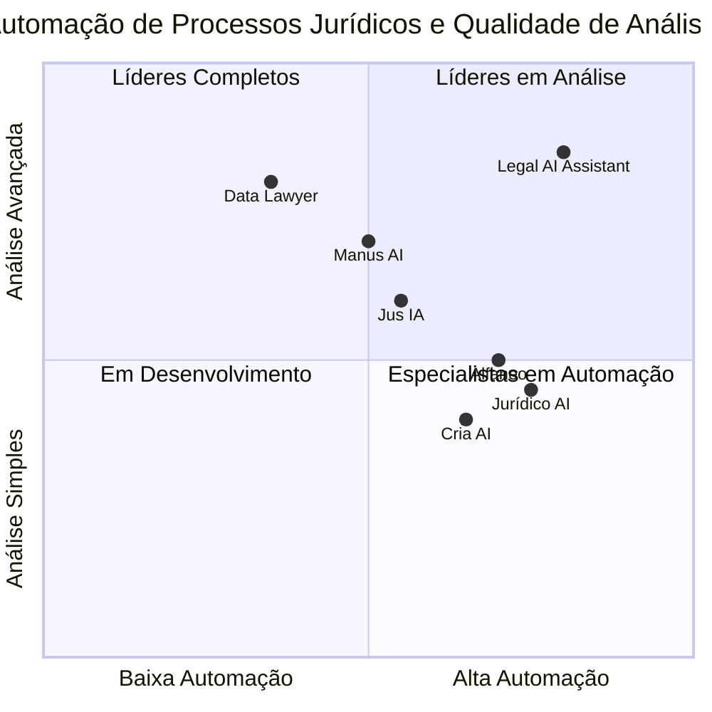

# Documento de Requisitos de Produto (PRD)

## Sistema Jurídico Assistido por IA

**Versão:** 1.0
**Data:** 02/06/2025
**Autor:** Emma, Product Manager

## 1. Informações do Projeto

### 1.1 Linguagem de Programação e Tecnologias
Backend: Python (FastAPI)
Frontend: React.js/Next.js
Processamento de IA: LangChain/LlamaIndex
Outras Tecnologias: python-docx, PyMuPDF/pdfplumber, Tesseract OCR

### 1.2 Nome do Projeto
legal_ai_assistant

### 1.3 Requisitos Originais
Desenvolvimento de um sistema jurídico assistido por IA com duas funcionalidades principais:
1. Análise de Petições Jurídicas (entrada: PDF)
2. Geração Automatizada de Defesas (saída: DOCX)

O sistema deve processar arquivos PDF como entrada e gerar documentos DOCX como saída, mantendo a formatação original dos templates fornecidos. Recomenda-se a integração com a API do GPT-4 Turbo da OpenAI para processamento de linguagem natural avançado.

## 2. Definição do Produto

### 2.1 Objetivos do Produto
1. Reduzir o tempo de análise de petições jurídicas em pelo menos 70%, permitindo que advogados foquem em tarefas estratégicas de maior valor agregado
2. Automatizar a geração de documentos de defesa com qualidade consistente, mantendo a identidade visual e os padrões do escritório
3. Aumentar a produtividade dos escritórios de advocacia através da extração e processamento inteligente de informações de documentos jurídicos

### 2.2 Histórias de Usuário

1. **Como** advogado sobrecarregado com múltiplos casos, **quero** analisar petições jurídicas rapidamente, **para que** eu possa entender os pontos principais sem precisar ler todo o documento.

2. **Como** profissional jurídico com pouco tempo disponível, **quero** gerar defesas automaticamente com base em templates pré-aprovados, **para que** eu possa responder rapidamente aos processos mantendo o padrão de qualidade.

3. **Como** advogado em um escritório de médio porte, **quero** extrair automaticamente pedidos e fundamentos legais de petições iniciais, **para que** eu possa estruturar argumentos de defesa mais direcionados e eficazes.

4. **Como** coordenador jurídico, **quero** que minha equipe produza documentos consistentes seguindo os padrões do escritório, **para que** possamos manter a identidade visual e a qualidade padronizada.

5. **Como** advogado atendendo múltiplos clientes, **quero** identificar rapidamente as teses de defesa mais adequadas com base em jurisprudência relevante, **para que** eu possa oferecer o melhor serviço possível aos meus clientes.

### 2.3 Análise Competitiva

| Software | Prós | Contras |
|----------|------|--------|
| **Jurídico AI** | - IA treinada na legislação brasileira<br>- Redução de até 94% no tempo de elaboração<br>- Especializado em geração de peças | - Sem análise de petições existentes<br>- Focado apenas em criação, não em análise<br>- Sem customização de templates |
| **Alfaneo** | - Pesquisa jurídica automatizada<br>- Geração completa de petições<br>- Estruturação profissional | - Limitado à criação de documentos<br>- Sem recursos de OCR avançados<br>- Sem análise de documentos externos |
| **Cria AI** | - Embasamento jurídico rastreável<br>- Economia de 70-80% do tempo<br>- Múltiplos tipos de documentos | - Sem análise de petições recebidas<br>- Sem manutenção de formatação personalizada<br>- Sem extração inteligente de informações |
| **Jus IA (Jusbrasil)** | - Grande base de dados jurídica<br>- Respostas fundamentadas<br>- Integração com plataforma Jusbrasil | - Sem geração baseada em templates<br>- Respostas generalizadas<br>- Limitada à plataforma Jusbrasil |
| **Data Lawyer** | - Base de dados com 55+ milhões de processos<br>- Pesquisa por similaridade<br>- Chat para consultas | - Focado em jurimetria, não em automação<br>- Sem geração de documentos<br>- Sem processamento de documentos externos |
| **Manus AI** | - Análise de contratos<br>- Multitarefas<br>- Relatórios detalhados | - Sem manutenção de formatação<br>- Sem processamento automático de OCR<br>- Limitado a certos tipos de documentos |
| **Nosso Produto** | - Análise completa de petições em PDF<br>- Geração de defesas com templates personalizados<br>- OCR avançado para qualquer tipo de documento<br>- Extração inteligente de informações jurídicas<br>- Manutenção de formatação e identidade visual | - Novo no mercado<br>- Requer integração com API externa<br>- Necessidade de treinamento inicial |

### 2.4 Quadrante Competitivo



## 3. Especificações Técnicas

### 3.1 Análise de Requisitos

O sistema jurídico assistido por IA deve ser capaz de processar documentos jurídicos em formato PDF (incluindo documentos escaneados), extrair informações relevantes utilizando OCR quando necessário, e gerar novos documentos em formato DOCX baseados em templates personalizados. O sistema deve utilizar a API do GPT-4 Turbo da OpenAI para realizar análises avançadas e geração de conteúdo jurídico personalizado.

A solução deve ser desenvolvida utilizando tecnologias modernas e escaláveis, com uma arquitetura que permita fácil manutenção e expansão futura. Além disso, devido à natureza sensível dos documentos jurídicos, o sistema deve implementar medidas robustas de segurança e privacidade de dados.

### 3.2 Pool de Requisitos

#### P0 (Must-have)

1. **Upload e processamento de documentos PDF**
   - O sistema deve permitir o upload de arquivos PDF
   - Deve implementar OCR para documentos escaneados
   - Deve extrair texto de PDFs nativos

2. **Análise de petições jurídicas**
   - Extração do resumo do caso
   - Identificação de pedidos e requerimentos
   - Listagem de leis e artigos citados
   - Identificação de provas apresentadas
   - Sugestão de teses de defesa viáveis

3. **Upload e processamento de templates DOCX**
   - O sistema deve permitir o upload de templates DOCX
   - Deve identificar marcadores/placeholders no documento
   - Deve manter a formatação original (fontes, margens, logos)

4. **Geração automatizada de defesas**
   - Preenchimento automático de templates com dados extraídos
   - Manutenção da formatação original
   - Exportação como arquivo DOCX editável

5. **Integração com API do GPT-4 Turbo**
   - Configuração de chaves de API
   - Comunicação segura com a API
   - Prompt engineering para casos jurídicos brasileiros

#### P1 (Should-have)

6. **Dashboard de gerenciamento**
   - Visualização de documentos processados
   - Status de processamento
   - Histórico de documentos gerados

7. **Backup e histórico de documentos**
   - Armazenamento seguro de documentos processados
   - Versionamento de documentos gerados
   - Função de recuperação de versões anteriores

8. **Customização de prompts para a IA**
   - Interface para personalização de instruções à IA
   - Ajuste de parâmetros de geração
   - Salvamento de prompts personalizados

9. **Processamento em lote**
   - Upload e processamento de múltiplos documentos
   - Geração em lote de defesas para casos similares

10. **Exportação de análises em formato resumido**
    - Geração de relatórios executivos das análises
    - Exportação em PDF ou DOCX

#### P2 (Nice-to-have)

11. **Integração com sistemas de gestão jurídica**
    - APIs para comunicação com outros softwares jurídicos
    - Importação/exportação de dados de sistemas terceiros

12. **Análise de jurisprudência relacionada**
    - Busca automática de jurisprudência relevante
    - Sugestão de precedentes aplicáveis ao caso

13. **Sugestões de melhoria para documentos**
    - Análise de clareza e objetividade
    - Sugestões de reformulação de argumentos

14. **Modo colaborativo**
    - Compartilhamento de análises entre usuários
    - Comentários e revisões colaborativas

15. **Aprendizado contínuo**
    - Feedback sobre resultados para melhorar análises futuras
    - Personalização baseada no histórico de uso

### 3.3 Esboço de Design de UI

#### Tela Principal - Dashboard

```
+-----------------------------------------------------+
|  Logo  |  Análise de Petições  |  Geração de Defesa |
+-----------------------------------------------------+
|                                                     |
|  +-------------+  +-------------+  +-------------+  |
|  | Últimas     |  | Petições    |  | Defesas     |  |
|  | Atividades  |  | Analisadas  |  | Geradas     |  |
|  +-------------+  +-------------+  +-------------+  |
|                                                     |
|  Estatísticas de Uso                               |
|  +-------------+  +-------------+  +-------------+  |
|  | Docs        |  | Tempo      |  | Economia    |  |
|  | Processados |  | Economizado|  | Estimada    |  |
|  +-------------+  +-------------+  +-------------+  |
|                                                     |
|  Ações Rápidas                                     |
|  +-----------+  +-----------+  +-----------+       |
|  | Nova      |  | Novo      |  | Acessar   |       |
|  | Análise   |  | Documento |  | Templates |       |
|  +-----------+  +-----------+  +-----------+       |
|                                                     |
+-----------------------------------------------------+
```

#### Tela de Análise de Petições

```
+-----------------------------------------------------+
|  Logo  |  Análise de Petições  |  Geração de Defesa |
+-----------------------------------------------------+
|                                                     |
|  Upload de Petição                                 |
|  +-------------------------------------------+     |
|  | Arrastar arquivo PDF ou clicar para upload|     |
|  +-------------------------------------------+     |
|                                                     |
|  Opções de Processamento                          |
|  [ ] Usar OCR para documentos escaneados           |
|  [ ] Análise detalhada de legislação               |
|  [ ] Buscar jurisprudência relacionada             |
|                                                     |
|  +----------+                                      |
|  | Analisar |                                      |
|  +----------+                                      |
|                                                     |
+-----------------------------------------------------+
```

#### Tela de Resultado de Análise

```
+-----------------------------------------------------+
|  Logo  |  Análise de Petições  |  Geração de Defesa |
+-----------------------------------------------------+
|  Petição: XXXX-XX.2023.X.XX.XXXX                   |
|                                                     |
|  +------------+  +----------+  +-------------+     |
|  | Resumo     |  | Pedidos  |  | Legislação  |     |
|  +------------+  +----------+  +-------------+     |
|                                                     |
|  Resumo do Caso                                    |
|  +-------------------------------------------+     |
|  | Texto gerado pela IA com resumo detalhado |     |
|  | do caso, incluindo partes, objeto da      |     |
|  | ação e principais argumentos...           |     |
|  +-------------------------------------------+     |
|                                                     |
|  +-------------+  +-----------------+              |
|  | Exportar    |  | Gerar Defesa    |              |
|  | Análise     |  | com base na     |              |
|  |             |  | Análise         |              |
|  +-------------+  +-----------------+              |
|                                                     |
+-----------------------------------------------------+
```

#### Tela de Geração de Defesa

```
+-----------------------------------------------------+
|  Logo  |  Análise de Petições  |  Geração de Defesa |
+-----------------------------------------------------+
|                                                     |
|  Selecionar Template                               |
|  +------------v+                                    |
|  | Contestação |                                    |
|  +-------------+                                    |
|                                                     |
|  Upload de Template Personalizado                  |
|  +-------------------------------------------+     |
|  | Arrastar arquivo DOCX ou clicar para upload|     |
|  +-------------------------------------------+     |
|                                                     |
|  Informações do Processo                          |
|  Número: [__________________]                      |
|  Partes: [__________________]                      |
|  Data:   [__________________]                      |
|                                                     |
|  +----------+                                      |
|  | Gerar    |                                      |
|  | Defesa   |                                      |
|  +----------+                                      |
|                                                     |
+-----------------------------------------------------+
```

### 3.4 Perguntas em Aberto

1. **Integração com sistemas existentes**:
   - Como o sistema se integrará com softwares de gestão jurídica já utilizados pelos escritórios?
   - Quais APIs ou protocolos serão suportados para essa integração?

2. **Limitações de processamento**:
   - Qual será o tamanho máximo de arquivos PDF suportado?
   - Quantas páginas o sistema conseguirá processar eficientemente?

3. **Customização avançada**:
   - Até que ponto os usuários poderão customizar os prompts enviados à IA?
   - Como equilibrar personalização com usabilidade?

4. **Privacidade e segurança de dados**:
   - Como garantir a confidencialidade dos documentos jurídicos processados?
   - Os documentos serão armazenados nos servidores ou apenas processados temporariamente?

5. **Precisão do OCR**:
   - Como lidar com documentos de baixa qualidade, manuscritos ou com formatações complexas?
   - Que medidas serão implementadas para verificação e correção de erros de OCR?

## 4. Personas de Usuários

### 4.1 Advogado de Alta Produtividade - Carlos (38 anos)
**Perfil**: Sócio em escritório médio, especializado em Direito Civil e Trabalhista
**Desafios**: Gerencia mais de 100 casos simultaneamente, precisa delegar eficientemente
**Necessidades**: Maximizar produtividade, manter qualidade consistente, analisar rapidamente novos casos
**Comportamentos**: Trabalha remotamente parte do tempo, utiliza múltiplos dispositivos, valoriza automação
**Objetivos com o produto**: Reduzir tempo de análise inicial de casos, manter padrão de qualidade em documentos gerados pela equipe, aumentar capacidade de atendimento

### 4.2 Advogada Iniciante - Mariana (27 anos)
**Perfil**: Recém-formada, trabalhando em escritório de pequeno porte
**Desafios**: Pouca experiência prática, insegurança na redação de peças complexas
**Necessidades**: Suporte na elaboração de documentos, aprendizado rápido, eficiência
**Comportamentos**: Tecnologicamente fluente, aberta a novas ferramentas, busca constante por conhecimento
**Objetivos com o produto**: Ganhar confiança na elaboração de peças, aprender com modelos bem estruturados, aumentar produtividade para crescer na carreira

### 4.3 Coordenador Jurídico - Roberto (45 anos)
**Perfil**: Coordenador de departamento jurídico em empresa de grande porte
**Desafios**: Gerenciar equipe, manter padrões de qualidade, lidar com volume alto de demandas
**Necessidades**: Controle de qualidade, padronização, geração de relatórios, gestão eficiente
**Comportamentos**: Valoriza processos estruturados, prefere soluções comprovadas, preocupa-se com compliance
**Objetivos com o produto**: Garantir uniformidade nas defesas da empresa, reduzir tempo de resposta a processos, melhorar métricas de desempenho da equipe

### 4.4 Advogada Autônoma - Laura (35 anos)
**Perfil**: Profissional independente com clientela diversificada
**Desafios**: Recursos limitados, necessidade de atuar em várias áreas, gestão de tempo
**Necessidades**: Versatilidade, eficiência, escalabilidade sem aumentar custos
**Comportamentos**: Multitarefa, trabalha em horários flexíveis, busca automação para crescer sem contratar
**Objetivos com o produto**: Ampliar capacidade de atendimento sem aumentar custos, gerar documentos de qualidade em áreas menos familiares, economizar tempo em análises preliminares

## 5. Análise Técnica

### 5.1 Arquitetura Proposta

```
+------------------+           +------------------+
|                  |           |                  |
|  Frontend Web    |<--------->|  Backend API     |
|  (React/Next.js) |   REST    |  (Python/FastAPI)|
|                  |           |                  |
+------------------+           +--------+---------+
                                        |
                                        |
                            +-----------v-----------+
                            |                      |
                            |  Processamento       |
                            |  (LangChain/         |
                            |   LlamaIndex)        |
                            |                      |
                            +-----------+-----------+
                                        |
                        +---------------+----------------+
                        |               |                |
               +--------v---+    +------v-----+   +-----v------+
               |            |    |            |   |            |
               | OpenAI API |    | PDF        |   | Document   |
               | (GPT-4     |    | Processing |   | Generation |
               |  Turbo)    |    | (PyMuPDF/  |   | (python-   |
               |            |    |  pdfplumber)|   |  docx)    |
               +------------+    +------------+   +------------+
```

### 5.2 Tecnologias Recomendadas

#### Backend
- **Python 3.10+**: Base da aplicação backend
- **FastAPI**: Framework web rápido e moderno para criação da API
- **LangChain/LlamaIndex**: Frameworks para integração com LLMs e processamento de documentos
- **PyMuPDF/pdfplumber**: Bibliotecas para extração de texto de PDFs
- **python-docx**: Manipulação de documentos DOCX
- **Tesseract OCR/pytesseract**: OCR para documentos escaneados
- **PostgreSQL/SQLAlchemy**: Armazenamento de dados e ORM
- **Redis**: Armazenamento em cache e filas de trabalho
- **Celery**: Processamento assíncrono de tarefas

#### Frontend
- **React.js/Next.js**: Framework para interface de usuário
- **Tailwind CSS**: Framework CSS para design responsivo
- **Axios**: Cliente HTTP para comunicação com API
- **React Query**: Gerenciamento de estado e cache
- **react-dropzone**: Upload de arquivos por drag-and-drop

#### Infraestrutura
- **Docker/Docker Compose**: Containerização
- **GitHub Actions/GitLab CI**: CI/CD
- **AWS S3/Azure Blob Storage**: Armazenamento de documentos
- **CloudFront/CDN**: Distribuição de conteúdo estático

### 5.3 Fluxos de Processamento

#### Análise de Petições
1. Upload do arquivo PDF
2. Verificação do tipo de documento (nativo ou escaneado)
3. Aplicação de OCR se necessário
4. Extração de texto do documento
5. Preparação do prompt para a API do GPT-4 Turbo
6. Envio do conteúdo para processamento pela IA
7. Recebimento e estruturação da análise
8. Apresentação dos resultados ao usuário
9. Armazenamento da análise para uso futuro

#### Geração de Defesa
1. Upload do template DOCX ou seleção de template existente
2. Análise do template para identificação de marcadores
3. Coleta de informações adicionais necessárias
4. Estruturação do prompt para a API do GPT-4 Turbo
5. Geração do conteúdo personalizado
6. Preenchimento do template mantendo formatação original
7. Revisão e ajustes finais pelo usuário
8. Exportação do documento final em formato DOCX

### 5.4 Requisitos Não-Funcionais

#### Desempenho
- Tempo máximo de processamento de PDF: 2 minutos para documentos até 50 páginas
- Tempo máximo de geração de defesa: 3 minutos
- Capacidade de processar até 100 documentos simultaneamente

#### Segurança
- Criptografia de dados em trânsito (HTTPS/TLS)
- Criptografia de dados em repouso (AES-256)
- Autenticação de dois fatores para acesso à plataforma
- Controle de acesso baseado em funções (RBAC)
- Auditoria de acessos e modificações

#### Disponibilidade
- SLA de 99.9% de disponibilidade (downtime máximo de 8,76 horas/ano)
- Backup diário de dados
- Redundância geográfica para alta disponibilidade

#### Usabilidade
- Interface responsiva (desktop, tablet, mobile)
- Tempo de carregamento de página inferior a 2 segundos
- Design intuitivo que requer mínimo treinamento
- Suporte a navegadores modernos (Chrome, Firefox, Safari, Edge)

#### Escalabilidade
- Arquitetura que suporte escala horizontal
- Balanceamento de carga automático
- Capacidade de escalar para 1000+ usuários concorrentes

## 6. Plano de Implementação

### 6.1 Cronograma Proposto

**Fase 1: Desenvolvimento Inicial (2 meses)**
- Configuração de infraestrutura e ambiente de desenvolvimento
- Implementação da API backend básica
- Desenvolvimento da funcionalidade de upload e processamento de PDF
- Integração inicial com a API do GPT-4 Turbo
- Desenvolvimento do front-end básico

**Fase 2: Funcionalidades Essenciais (2 meses)**
- Implementação completa da análise de petições
- Desenvolvimento do sistema de templates DOCX
- Implementação da geração de defesas
- Testes de integração e validação

**Fase 3: Refinamento e Recursos Adicionais (1 mês)**
- Dashboard de gerenciamento
- Sistema de armazenamento e histórico
- Melhorias de UX/UI
- Otimizações de desempenho

**Fase 4: Beta e Lançamento (1 mês)**
- Testes beta com usuários selecionados
- Correção de bugs e ajustes finais
- Documentação e treinamento
- Lançamento da versão 1.0

### 6.2 Métricas de Sucesso

- **Redução de tempo**: Diminuição de pelo menos 70% no tempo de análise de petições
- **Adoção pelos usuários**: 80% dos usuários utilizando a plataforma regularmente após 3 meses
- **Qualidade das análises**: Precisão mínima de 90% nas informações extraídas (validado por advogados especialistas)
- **Satisfação do usuário**: NPS (Net Promoter Score) mínimo de 40 após 6 meses
- **Eficiência operacional**: Aumento de 50% na capacidade de processamento de casos por advogado

## 7. Considerações Finais

O Sistema Jurídico Assistido por IA representa uma evolução significativa na forma como escritórios de advocacia e departamentos jurídicos lidam com documentos e processos. Ao automatizar tarefas repetitivas e de alto consumo de tempo, como a análise de petições e a geração de documentos de defesa, o sistema permitirá que profissionais jurídicos foquem em atividades estratégicas e de maior valor agregado.

A combinação de tecnologias modernas de processamento de documentos com a inteligência artificial avançada do GPT-4 Turbo possibilitará uma solução robusta, confiável e extremamente útil para o dia a dia dos profissionais do direito no Brasil. A implementação faseada garantirá que as funcionalidades essenciais sejam entregues com qualidade e que o produto evolua de acordo com o feedback dos usuários.

Com o mercado de tecnologia jurídica em rápida expansão no Brasil, há uma janela de oportunidade ideal para a introdução deste produto, que se diferencia por oferecer uma solução completa que abrange tanto a análise quanto a geração de documentos, mantendo sempre a qualidade e os padrões profissionais esperados na área jurídica.